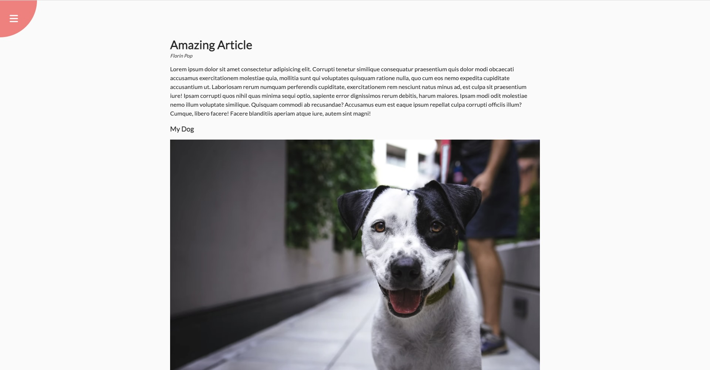
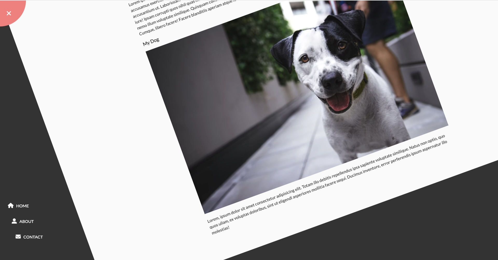

# Rotating Navigation Animation

For this project I built a simple article/blog page. The animation for this project happens when a user clicks the navigation selection (hamburger button) in the top left corner. From there the page rotates and flips up to reveal the hidden navigation links. This project is a fun replacement for a navbar in a simple web page.

[View deployed page here](https://caitlinswickard.github.io/Rotating_navigation_animation/)
- [Installation](#install)
- [Usage](#usage)

## Install

Clone project:
- https://docs.github.com/en/repositories/creating-and-managing-repositories/cloning-a-repository

## Usage
Open page in live web browser and click on navigation hamburger bar in top left corner. The page will rotate to the right to reveal hidden navigation links. 

## Built With

- HTML
- CSS
- JavaScript

## View

#### Credits
50 projects in 50 days HTML, CSS & JavaScript Udemy course